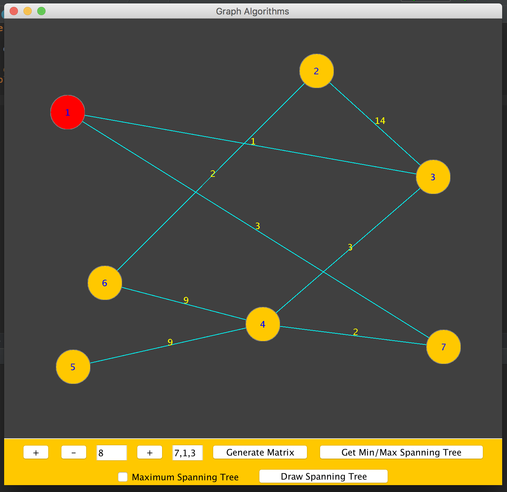
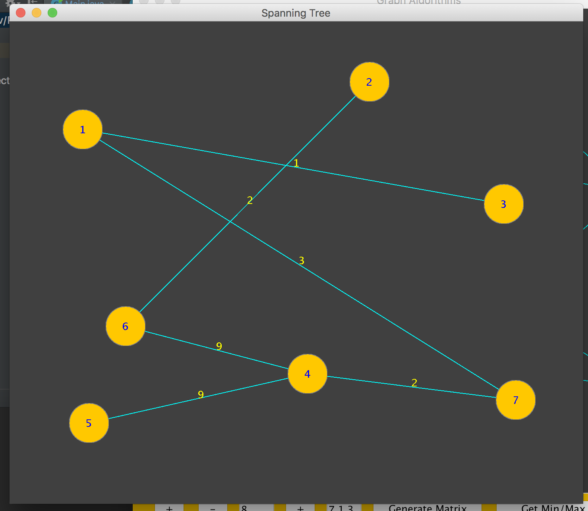

## Prim's Algorithm

[Prim's algorithm](https://en.wikipedia.org/wiki/Prim%27s_algorithm) is a greedy algorithm for finding the minimum spanning tree for a weighted directed graph. 

This is an implementation of the algorithm, with a ui to create the graph by adding nodes and weighted edges, and displaying the spanning tree.

### UI

